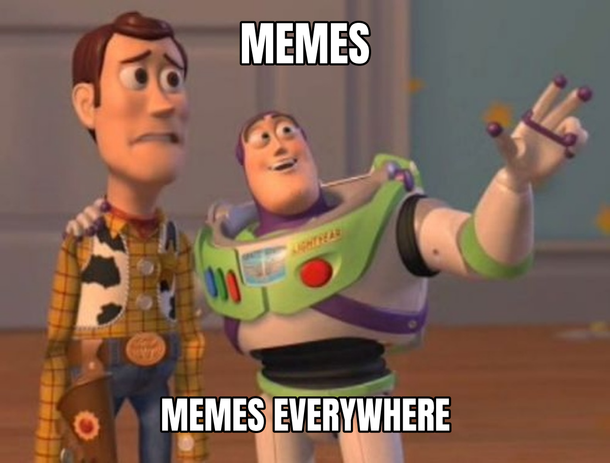
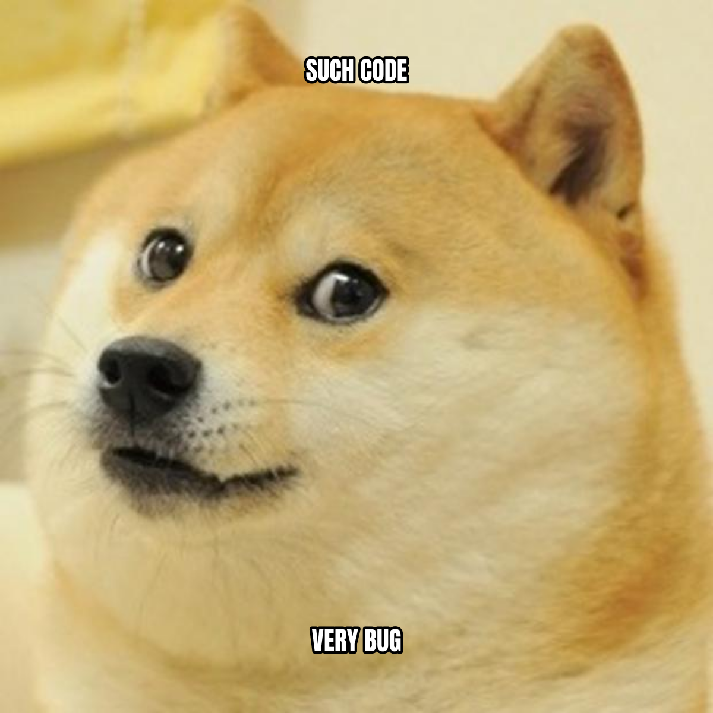
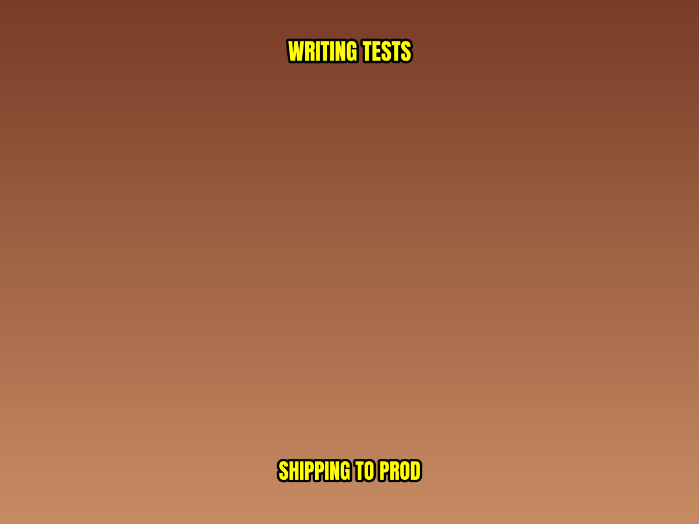
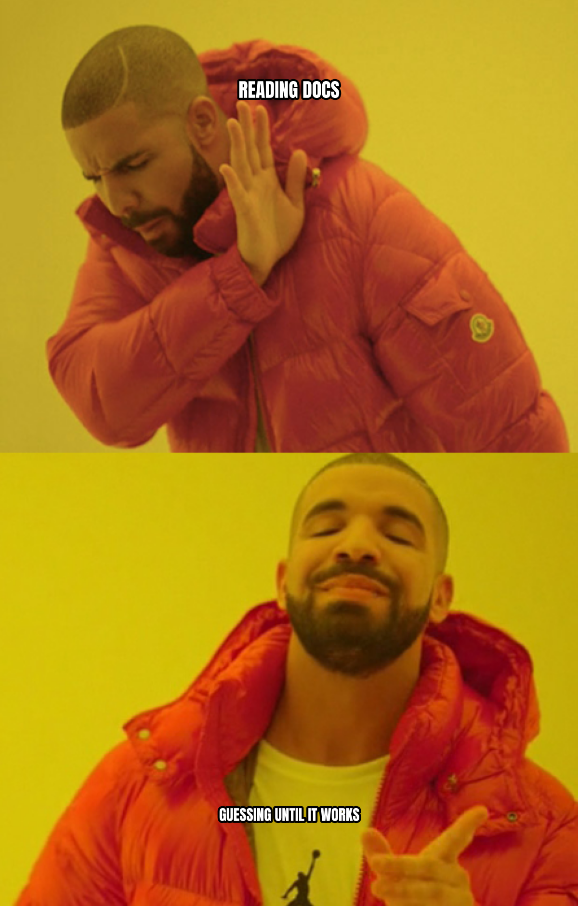
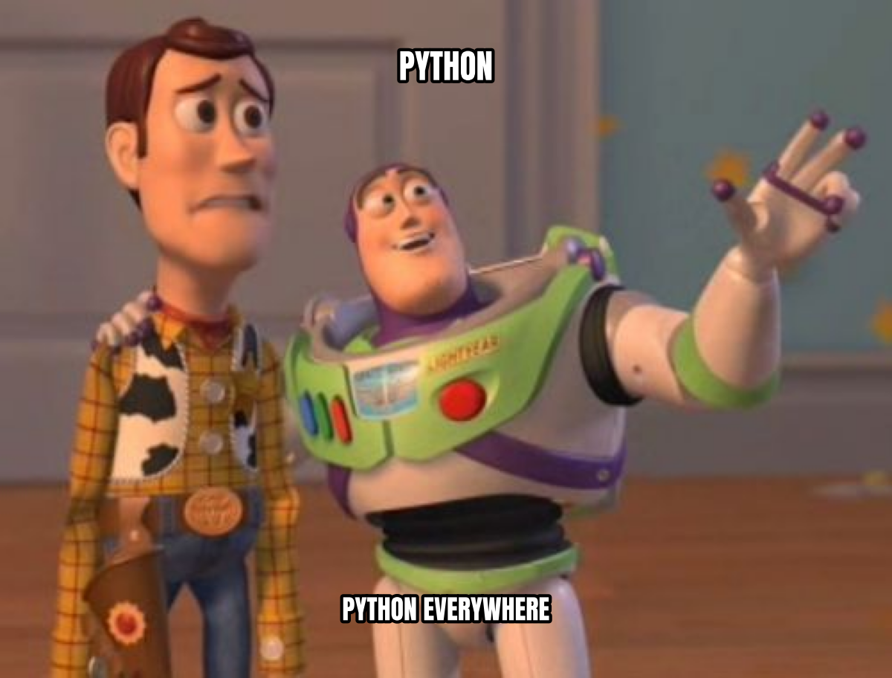
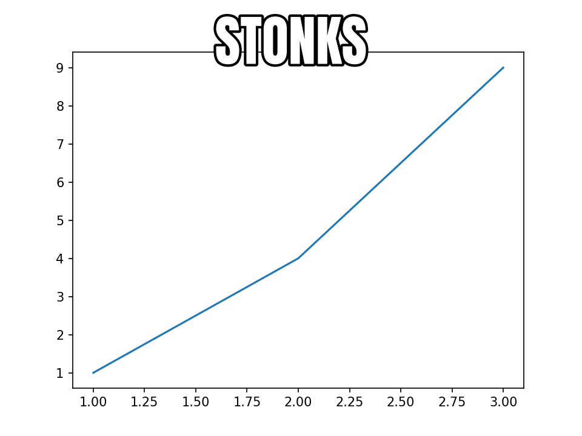
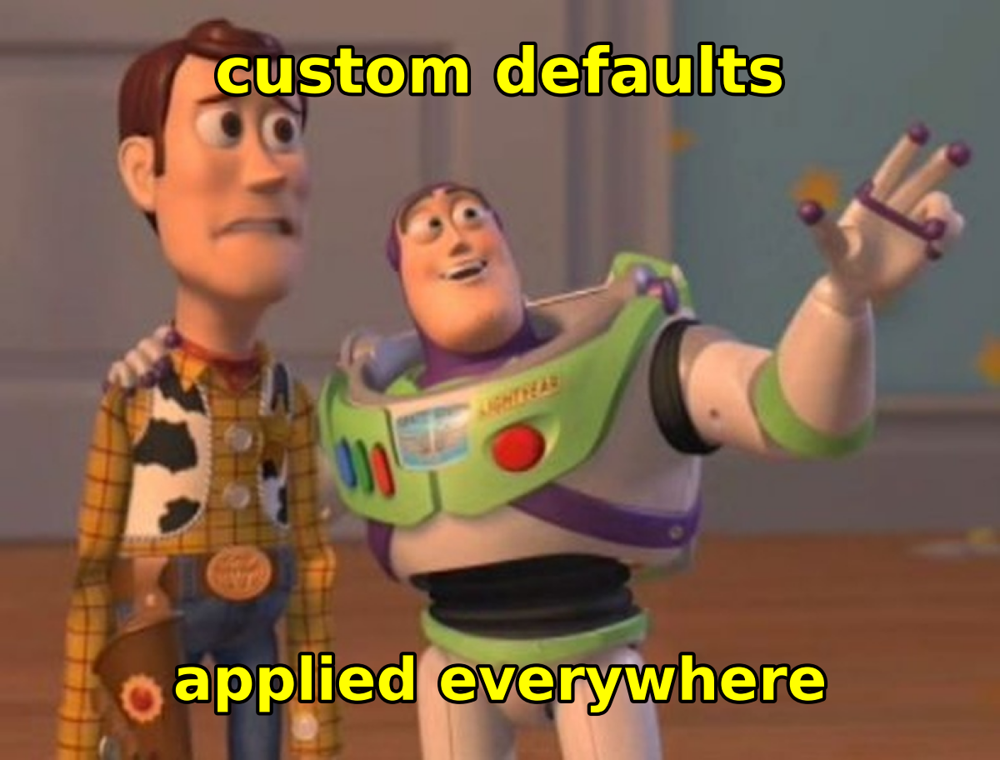

[](https://pypi.org/project/memeplotlib/)
[](https://anaconda.org/conda-forge/memeplotlib)
[](https://pypi.org/project/memeplotlib/)
[](https://opensource.org/licenses/MIT)


Memes with Python's matplotlib. Create image macro memes using matplotlib for rendering and the [memegen](https://github.com/jacebrowning/memegen) API for template discovery.

## Installation

**pip:**

```bash
pip install memeplotlib
```

**conda:**

```bash
conda install -c conda-forge memeplotlib
```

## Quick Start

```python
import memeplotlib as memes

# One-liner meme from a memegen template
memes.meme("buzz", "memes", "memes everywhere")
```



```python
# Save to file
memes.meme("doge", "such code", "very bug", savefig="meme.png", show=False)
```



## Features

### Functional API

```python
import memeplotlib as memes

# Customize text styling
memes.meme("drake", "writing tests", "shipping to prod",
           font="impact", color="yellow")
```



```python
# Get figure/axes back for further customization
fig, ax = memes.meme("distracted", "my project", "new framework", "me",
                      show=False)
```


```python
# Use a local image as template
memes.meme("/path/to/image.jpg", "top text", "bottom text")
```

### Object-Oriented API

```python
from memeplotlib import Meme

# Step by step
m = Meme("drake")
m.top("reading docs")
m.bottom("guessing until it works")
m.save("output.png")
```



```python
# Or chained
Meme("buzz").top("python").bottom("python everywhere").show()
```



### Memify Existing Plots

Turn any matplotlib figure into a meme:

```python
import matplotlib.pyplot as plt
import memeplotlib as memes

fig, ax = plt.subplots()
ax.plot([1, 2, 3], [1, 4, 9])
memes.memify(fig, "stonks")
```



### Global Configuration

```python
import memeplotlib as memes

memes.config.font = "comic"
memes.config.color = "yellow"
memes.config.fontsize = 120  # base font size in points
memes.config.style = "none"  # don't auto-uppercase

memes.meme("buzz", "custom defaults", "applied everywhere", show=False)
```



### Template Discovery

```python
from memeplotlib import TemplateRegistry

reg = TemplateRegistry()
results = reg.search("dog")
all_templates = reg.list_all()
```

## Documentation

Full documentation including a tutorial, user guide, and API reference is
available at [brianckeegan.github.io/memeplotlib](https://brianckeegan.github.io/memeplotlib/).

To build the docs locally:

```bash
pip install -e ".[docs]"
cd docs
make html
open _build/html/index.html
```

## How It Works

1. Templates are fetched from the [memegen API](https://api.memegen.link) (blank background images + metadata)
2. Images are cached locally for offline reuse
3. Text is rendered using matplotlib's text system with `patheffects.Stroke` for the classic outlined meme look
4. An Impact-like font (Anton) is bundled as a fallback for systems where Impact isn't installed

## Dependencies

- `matplotlib >= 3.0.0`
- `requests`
- `numpy`
- `Pillow`
- `platformdirs`

Requires Python 3.10+.

## License

MIT
