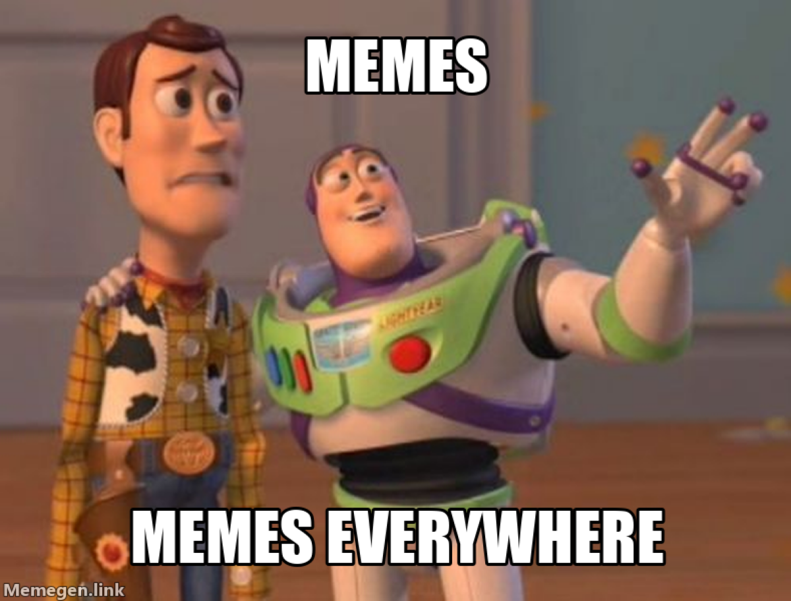
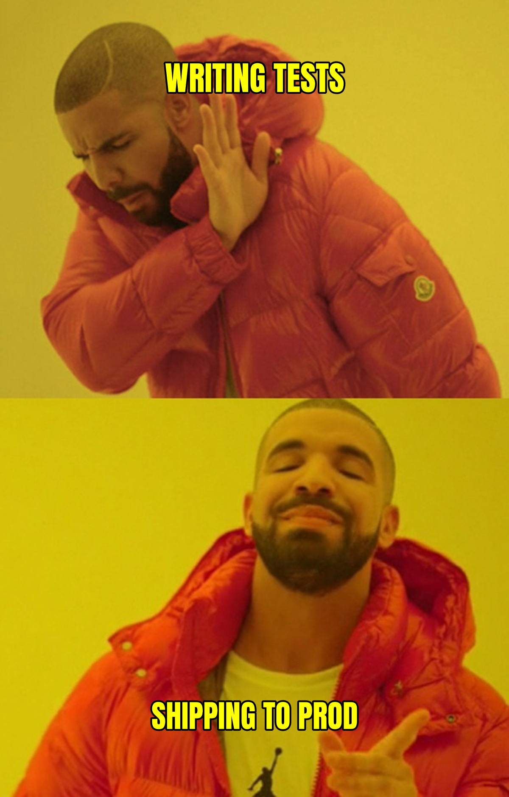
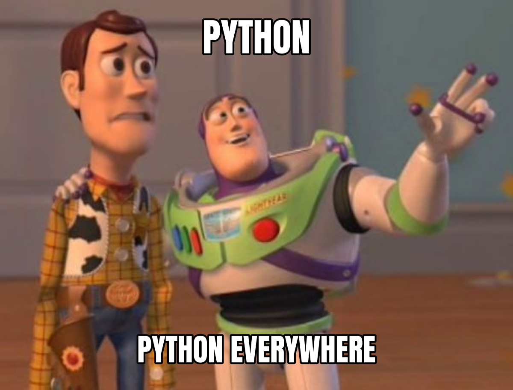
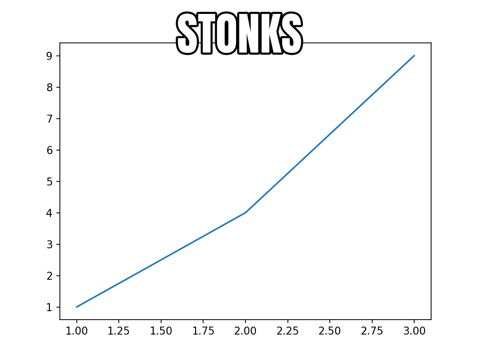
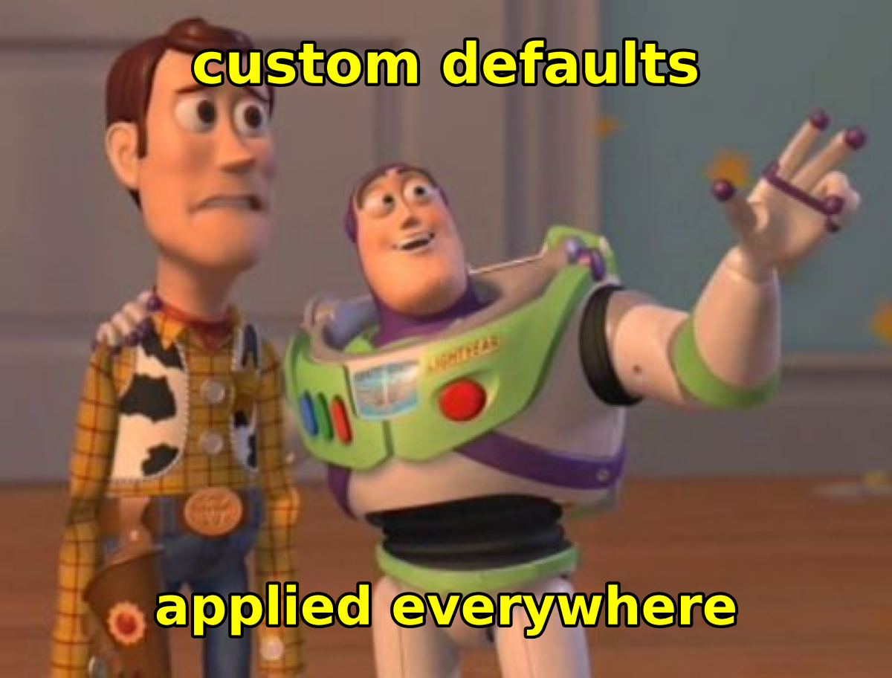

[](https://github.com/brianckeegan/memeplotlib/actions/workflows/ci.yml)
[](https://codecov.io/gh/brianckeegan/memeplotlib)
[](https://brianckeegan.github.io/memeplotlib/)
[](https://pypi.org/project/memeplotlib/)
[](https://anaconda.org/conda-forge/memeplotlib)
[](https://pypi.org/project/memeplotlib/)
[](https://opensource.org/licenses/MIT)


Memes with Python's matplotlib. Create image-macro memes by either letting
the [memegen](https://github.com/jacebrowning/memegen) API render them
server-side (the default) or falling back to a local Pillow renderer when
the API can't express what you want — custom local images, explicit per-line
font sizes, custom outlines, or per-line position overrides.

## Installation

```bash
pip install memeplotlib
# or
conda install -c conda-forge memeplotlib
```

For the [Model Context Protocol](https://modelcontextprotocol.io) server (use
memes from Claude Desktop / Claude Code / any MCP client):

```bash
pip install "memeplotlib[mcp]"
```

## Quick start

```python
import memeplotlib as memes

fig, ax = memes.meme("buzz", "memes", "memes everywhere")
fig.savefig("buzz.png")
```



The function returns `(Figure, Axes)` — same convention as `seaborn`,
`pandas.plot`, and other matplotlib extensions. It does not call
`plt.show()` implicitly. Pass `show=True` if you want auto-display.

## Features

**Memegen IDs, file paths, or URLs as templates:**

```python
memes.meme("drake", "writing tests", "shipping to prod", color="yellow")
memes.meme("/path/to/image.jpg", "top text", "bottom text")
memes.meme("https://example.com/image.png", "from a URL")
```



**Object-oriented `Meme` builder, chainable:**

```python
from memeplotlib import Meme

Meme("buzz").top("python").bottom("python everywhere").save("buzz.png")
```



**Memify existing matplotlib figures:**

```python
import matplotlib.pyplot as plt

fig, ax = plt.subplots()
ax.plot([1, 2, 3], [1, 4, 9])
memes.memify(fig, "stonks")
```



**RcParams-style scoped configuration:**

```python
with memes.rc_context({"font": "comic", "color": "yellow"}):
    memes.meme("buzz", "scoped style", "no leakage")
# defaults are auto-restored here

# Or set globally:
memes.config["fontsize"] = 96
```



**Forward `**kwargs` to `Axes.text`:**

```python
memes.meme("buzz", "rotated", rotation=15, alpha=0.8)
```

## Backends

`memeplotlib` ships three rendering backends. The default `"auto"` policy
picks the best fit; pass `backend="..."` to override.

| Backend       | What it does                                                                                       | Honours                                                              |
| ------------- | -------------------------------------------------------------------------------------------------- | -------------------------------------------------------------------- |
| `memegen`     | Builds a memegen rendering URL and `imshow`s the response. No client-side text drawing.            | `font`, `color`, `style`, `template_style`, `width`, `height`, `layout`, `background`, `overlays`, `extension` (`png`/`jpg`/`gif`/`webp`) |
| `pillow`      | Downloads the blank, draws captions client-side with `PIL.ImageDraw`. Used for custom local images and any feature memegen can't express. | All caption styling including per-line `fontsize`, custom `outline_color` / `outline_width`, and per-line overrides via `Meme.line(...)`. |
| `matplotlib`  | Legacy: draws captions with `Axes.text` + `patheffects.Stroke`. Kept for backwards compatibility.  | All caption styling **plus** `**kwargs` forwarded to `Axes.text` (e.g. `rotation`, `alpha`).                       |

`backend="auto"` selects:

- **`memegen`** — when the template comes from the memegen catalogue and the
  caller didn't pass `fontsize`, a non-default `outline_color` /
  `outline_width`, `**text_kwargs`, or per-line overrides.
- **`pillow`** — for custom local images / arbitrary URLs, or when any of
  the above client-only features were requested.

```python
# Default: memegen renders this server-side.
memes.meme("buzz", "memes", "memes everywhere", template_style="default",
           font="impact", width=600)

# Pillow fallback — explicit fontsize forces it.
memes.meme("/path/to/photo.jpg", "top", "bottom", fontsize=48,
           outline_color="red", outline_width=4)

# Per-line overrides force the Pillow backend.
from memeplotlib import Meme
Meme("buzz").top("hi").line(1, "world", fontsize=72, color="yellow").save("out.png")

# Legacy matplotlib path (preserves old behaviour exactly):
memes.meme("buzz", "rotated", rotation=15, alpha=0.8, backend="matplotlib")
```

See [`docs/url_construction.rst`](docs/url_construction.rst) for the full
memegen URL grammar — escape table, query parameters, font / style / overlay
reference — adapted from [jacebrowning/memegen #993][issue-993].

[issue-993]: https://github.com/jacebrowning/memegen/issues/993

## Use from agents

```bash
pip install "memeplotlib[mcp]"
memeplotlib-mcp                                 # boot the MCP server (stdio)
memeplotlib meme buzz "hello" "world" -o /tmp/  # CLI render
```

The MCP server exposes `meme`, `search_templates`, and `list_templates`
tools. The CLI is useful even without MCP — agent harnesses can shell
out, and CI scripts can render directly.

## Documentation

Full docs including a tutorial, user guide, conventions reference, and API
reference: [brianckeegan.github.io/memeplotlib](https://brianckeegan.github.io/memeplotlib/).

Build locally:

```bash
pip install -e ".[docs]"
sphinx-build -W docs docs/_build
```

## How it works

1. Template metadata comes from the [memegen API](https://api.memegen.link)
   (`/templates/`, `/templates/<id>`); blank backgrounds and rendered memes
   alike are cached on disk.
2. **Memegen backend** (default for memegen IDs): a fully-formed rendering
   URL (`/images/<id>/<line_1>/.../<line_n>.<ext>?style=...&font=...`) is
   built via `memeplotlib.build_memegen_url`. The composed image is fetched
   and displayed with `Axes.imshow`.
3. **Pillow backend** (default for custom images, or when client-only
   features are requested): the blank is fetched once, then captions are
   drawn with `PIL.ImageDraw` using stroke-aware text rendering and a
   shrink-to-fit loop, and the composed RGBA array is `imshow`n.
4. **Matplotlib backend** (legacy, opt-in): captions are drawn with
   `Axes.text` plus `patheffects.Stroke` for the classic outlined look.
5. The bundled Anton font (Impact-like, SIL OFL licensed) is used as a
   fallback for systems where Impact isn't installed.

## Related projects

- [matplotlib](https://matplotlib.org/) — the rendering engine.
- [memegen](https://github.com/jacebrowning/memegen) — the template registry
  and blank-image source (api.memegen.link).
- [seaborn](https://seaborn.pydata.org/) — the API conventions for
  `ax=None`, `**kwargs` forwarding, and `(fig, ax)` returns are modeled on
  seaborn.

## Dependencies

- `matplotlib >= 3.8`
- `numpy`, `requests`, `Pillow`, `platformdirs`

Requires Python 3.10+.

## License

MIT. The bundled Anton font is licensed under the
[SIL Open Font License v1.1](src/memeplotlib/fonts/OFL.txt).
