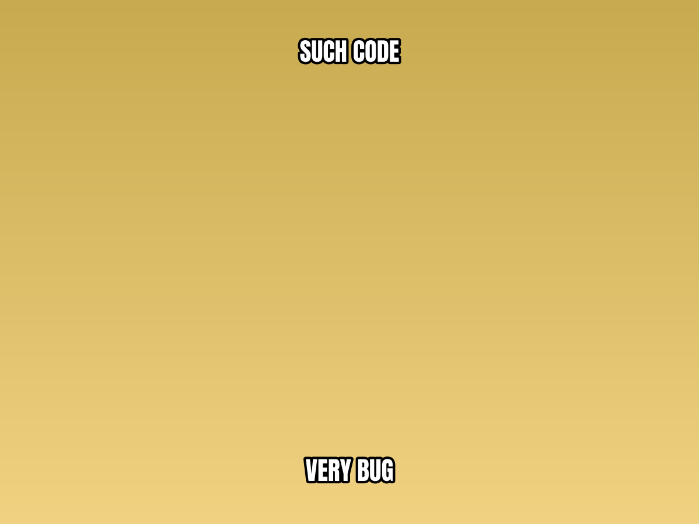
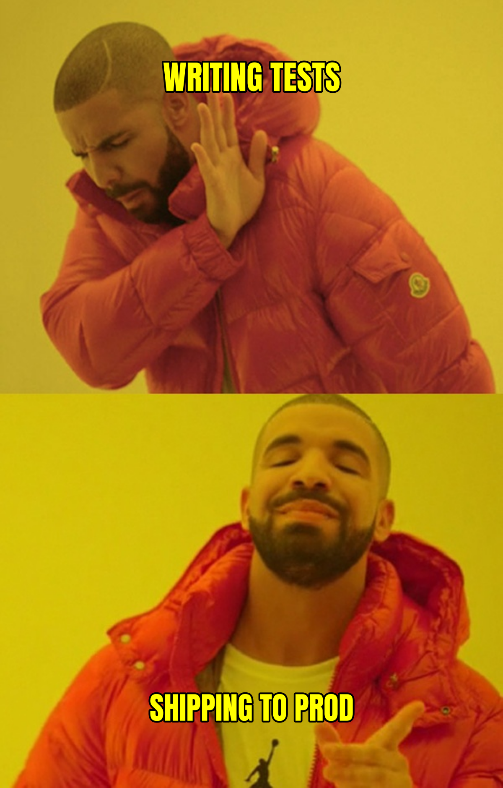
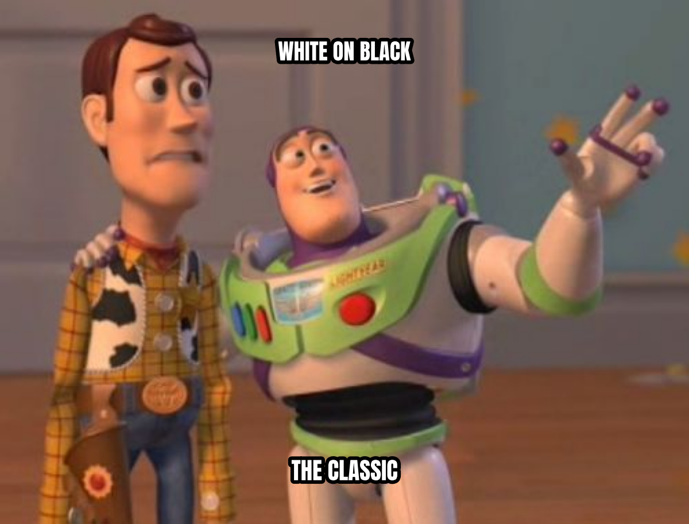

Getting Started
===============

This tutorial walks you through installing memeplotlib and creating your
first memes.

Installation
------------

Install memeplotlib from PyPI:

.. code-block:: bash

   pip install memeplotlib

To build the documentation locally, also install Sphinx and its dependencies:

.. code-block:: bash

   pip install memeplotlib[docs]

Your First Meme
----------------

The simplest way to create a meme is with the :func:`~memeplotlib.meme`
function:

.. code-block:: python

   import memeplotlib as memes

   memes.meme("buzz", "memes", "memes everywhere")

.. image:: _static/examples/tutorial_first_meme.png
   :alt: Buzz Lightyear "memes / memes everywhere"
   :width: 400px

This fetches the "Buzz Lightyear" template from the `memegen API
<https://api.memegen.link>`_, renders "MEMES" at the top and
"MEMES EVERYWHERE" at the bottom, and displays the result with
``matplotlib.pyplot.show()``.

The first positional argument is the template identifier, and subsequent
positional arguments are text lines placed at the template's text positions
(typically top and bottom).

Saving to a File
-----------------

Pass ``savefig`` to write the meme to disk. Set ``show=False`` if you do not
want an interactive window:

.. code-block:: python

   memes.meme("doge", "such code", "very bug",
              savefig="meme.png", show=False)

The output file format is determined by the file extension (PNG, JPEG, PDF,
SVG, etc.), following matplotlib's conventions.

Customizing Text
-----------------

Control font, color, and style:

.. code-block:: python

   memes.meme("drake", "writing tests", "shipping to prod",
              font="impact", color="yellow", style="upper")

Available ``style`` values:

- ``"upper"`` (default) -- converts text to UPPERCASE.
- ``"lower"`` -- converts text to lowercase.
- ``"none"`` -- preserves original casing.

Available ``font`` shortcuts: ``"impact"``, ``"arial"``, ``"comic"``,
``"times"``, ``"courier"``. You can also pass any font family name installed
on your system.

Font Size
~~~~~~~~~~

Use ``fontsize`` to set the text size in points. When omitted, font size is
auto-calculated from the default base size (``config.fontsize``, 72 pt):

.. code-block:: python

   memes.meme("buzz", "big text", fontsize=120, show=False)

You can also change the default base size globally:

.. code-block:: python

   memes.config.fontsize = 120

Controlling Outline
~~~~~~~~~~~~~~~~~~~~

The classic meme look uses white text with a black outline. You can customize
both:

.. code-block:: python

   memes.meme("buzz", "white on black", "the classic",
              color="white", outline_color="black", outline_width=3.0,
              show=False)

Using Local Images
-------------------

You can pass a file path instead of a memegen template ID:

.. code-block:: python

   memes.meme("/path/to/image.jpg", "top text", "bottom text")

HTTP/HTTPS URLs also work:

.. code-block:: python

   memes.meme("https://example.com/image.png", "hello", "world")

Getting the Figure Back
------------------------

:func:`~memeplotlib.meme` returns a ``(Figure, Axes)`` tuple, so you can
continue to modify the plot before saving or showing:

.. code-block:: python

   fig, ax = memes.meme("buzz", "memes", "memes everywhere", show=False)
   fig.savefig("custom_meme.png", dpi=300)

.. image:: _static/examples/tutorial_figure_back.png
   :alt: Buzz Lightyear returned as a Figure object
   :width: 400px

Next Steps
----------

- See the :doc:`user_guide` for the object-oriented API, memify workflow,
  global configuration, and template discovery.
- See the :doc:`api` for the complete API reference.
- Browse the :doc:`auto_examples/index` for runnable examples with output.
