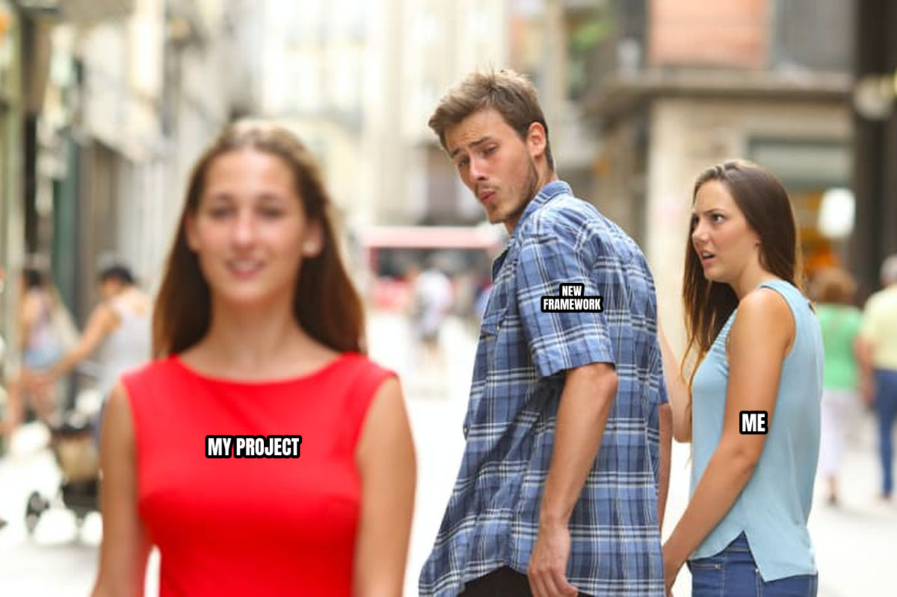
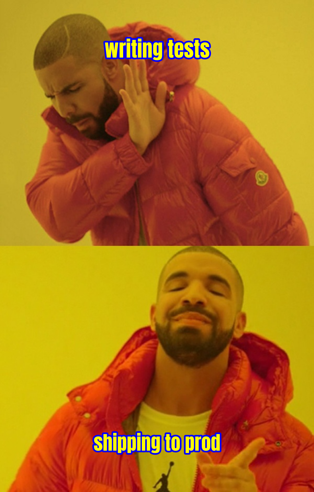
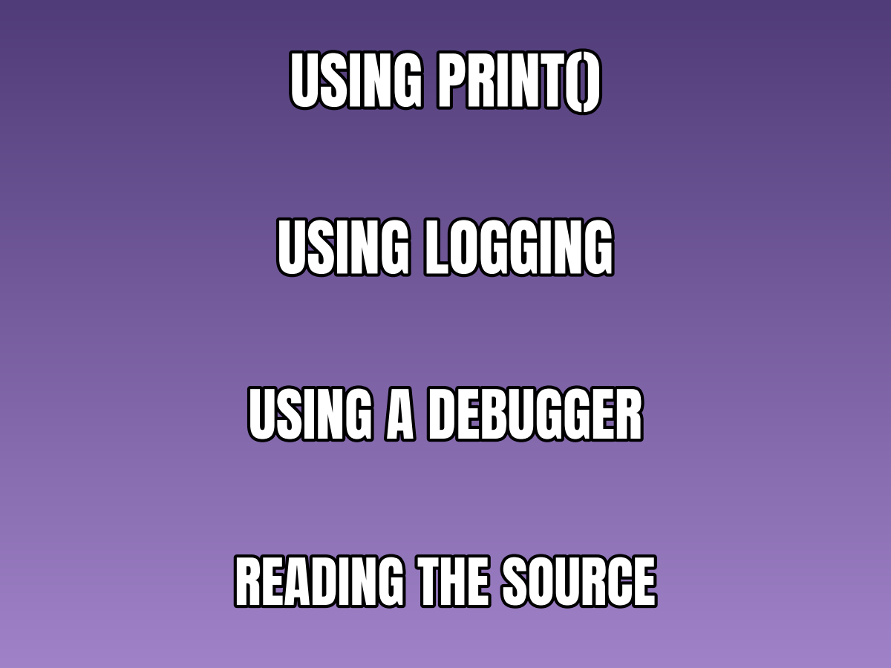
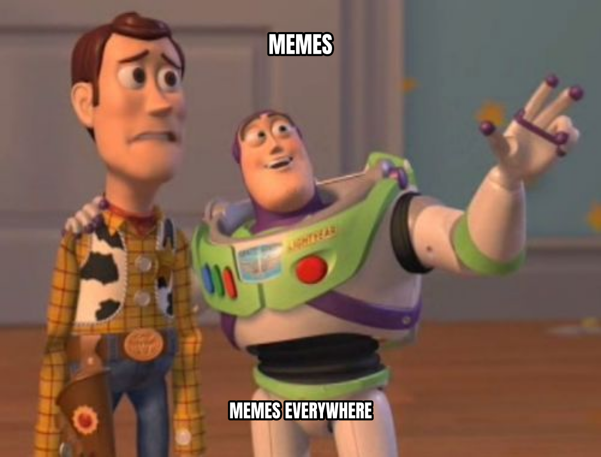
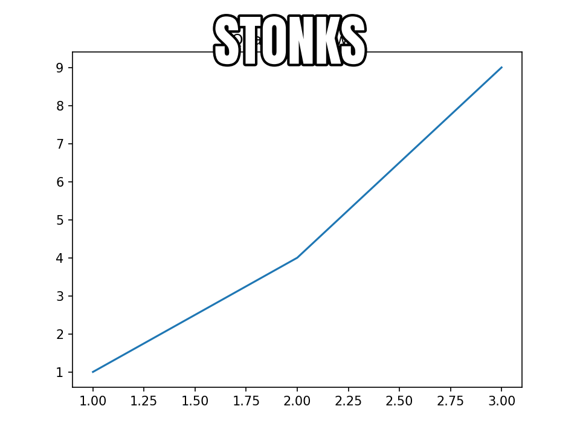
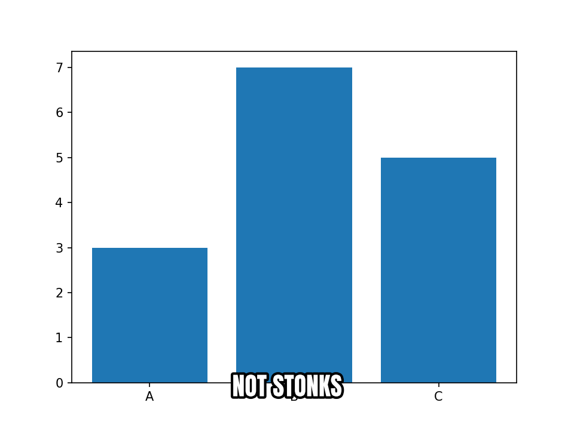
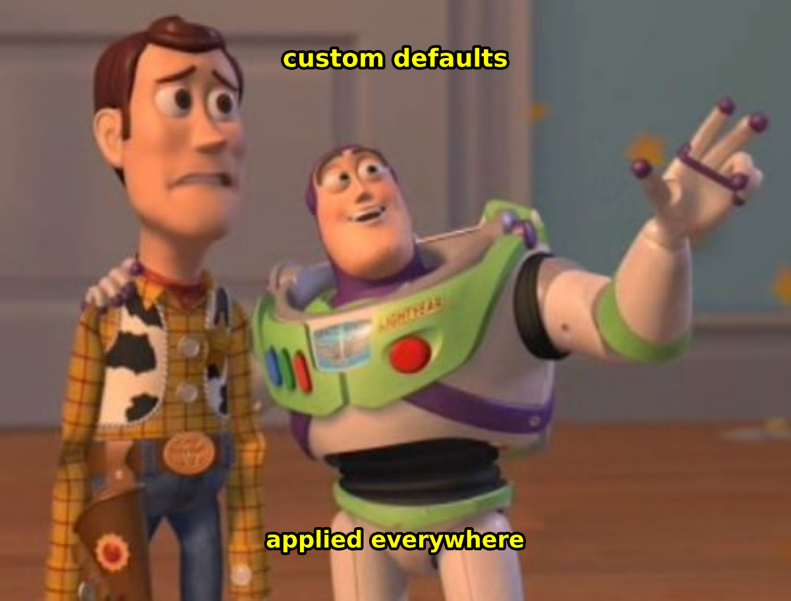
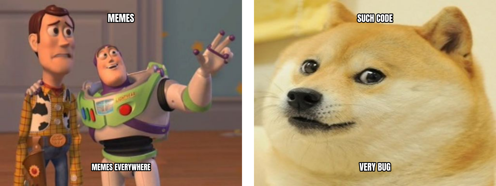

User Guide
==========

This guide covers the full breadth of memeplotlib's functionality.

.. contents:: On this page
   :local:
   :depth: 2

Functional API
--------------

The :func:`~memeplotlib.meme` function is the quickest way to create a meme.
It returns a ``(Figure, Axes)`` tuple so you can continue to modify the plot:

.. code-block:: python

   import memeplotlib as memes

   fig, ax = memes.meme("distracted", "my project", "new framework", "me",
                         show=False)
   fig.savefig("distracted.png", dpi=200)

All text styling parameters are available as keyword arguments:

.. code-block:: python

   memes.meme("drake", "writing tests", "shipping to prod",
              font="impact", color="yellow", outline_color="blue",
              outline_width=3.0, style="none", show=False)

Object-Oriented API
--------------------

The :class:`~memeplotlib.Meme` class provides a fluent, chainable interface:

.. code-block:: python

   from memeplotlib import Meme

   Meme("doge").top("such code").bottom("very bug").show()

.. image:: _static/examples/ug_oo_doge.png
   :alt: Doge "such code / very bug" via method chaining
   :width: 400px

You can also build a meme step-by-step:

.. code-block:: python

   m = Meme("buzz")
   m.top("memes")
   m.bottom("memes everywhere")
   fig, ax = m.render()
   m.save("output.png")

.. image:: _static/examples/ug_oo_buzz.png
   :alt: Buzz Lightyear "memes / memes everywhere" step-by-step
   :width: 400px

The :meth:`~memeplotlib.Meme.text` method sets text at an arbitrary index,
which is useful for templates with more than two text positions:

.. code-block:: python

   m = Meme("expanding-brain")
   m.text(0, "using print()")
   m.text(1, "using logging")
   m.text(2, "using a debugger")
   m.text(3, "reading the source")
   m.show()

You can also pass initial text lines directly to the constructor:

.. code-block:: python

   m = Meme("buzz", "memes", "memes everywhere")
   m.show()

Memifying Existing Figures
---------------------------

The :func:`~memeplotlib.memify` function overlays meme-style text on any
existing matplotlib figure:

.. code-block:: python

   import matplotlib.pyplot as plt
   import memeplotlib as memes

   fig, ax = plt.subplots()
   ax.plot([1, 2, 3], [1, 4, 9])
   ax.set_title("Quadratic growth")
   memes.memify(fig, "stonks")

The ``position`` parameter controls text layout:

- ``"top-bottom"`` (default) -- text at the top and bottom.
- ``"top"`` -- text at the top only.
- ``"bottom"`` -- text at the bottom only.
- ``"center"`` -- text centered vertically.

.. code-block:: python

   fig, ax = plt.subplots()
   ax.bar(["A", "B", "C"], [3, 7, 5])
   memes.memify(fig, "not stonks", position="bottom")

Global Configuration
---------------------

The :data:`~memeplotlib.config` object (an instance of
:class:`~memeplotlib._config.MemeplotlibConfig`) holds defaults that apply
to every meme creation call unless overridden by keyword arguments:

.. code-block:: python

   import memeplotlib as memes

   memes.config.font = "comic"
   memes.config.color = "yellow"
   memes.config.outline_color = "blue"
   memes.config.outline_width = 3.0
   memes.config.style = "none"

All configurable attributes:

.. list-table::
   :header-rows: 1
   :widths: 20 15 65

   * - Attribute
     - Default
     - Description
   * - ``font``
     - ``"impact"``
     - Font family name.
   * - ``color``
     - ``"white"``
     - Text fill color.
   * - ``outline_color``
     - ``"black"``
     - Text outline/stroke color.
   * - ``outline_width``
     - ``2.0``
     - Outline stroke width.
   * - ``fontsize``
     - ``72.0``
     - Base font size in points for auto-sizing. Explicit ``fontsize``
       keyword arguments override this.
   * - ``dpi``
     - ``150``
     - Dots per inch for figure rendering.
   * - ``style``
     - ``"upper"``
     - Text transform -- ``"upper"``, ``"lower"``, or ``"none"``.
   * - ``cache_enabled``
     - ``True``
     - Whether disk caching is enabled.
   * - ``cache_dir``
     - ``None``
     - Custom cache directory (platform default if ``None``).
   * - ``api_base``
     - ``"https://api.memegen.link"``
     - Base URL for the memegen API.

Template Discovery
-------------------

The :class:`~memeplotlib.TemplateRegistry` class lets you search and browse
the available meme templates:

.. code-block:: python

   from memeplotlib import TemplateRegistry

   reg = TemplateRegistry()

   # Search by keyword
   results = reg.search("dog")
   for r in results:
       print(r["id"], r["name"])

   # List all templates
   all_templates = reg.list_all()

   # Fetch a specific template
   template = reg.get("doge")

   # Force refresh from the API
   reg.refresh()

Templates are represented by the :class:`~memeplotlib.Template` dataclass.
You can create templates from local images or URLs using class methods:

.. code-block:: python

   from memeplotlib import Template

   # From a local image
   t = Template.from_image("my_photo.jpg", lines=3, name="Custom")

   # From a URL
   t = Template.from_image("https://example.com/image.png")

   # From the memegen API
   t = Template.from_memegen("buzz")

Caching
--------

memeplotlib caches downloaded template images and the template catalog to
disk so that subsequent runs do not require network access. The cache uses
a two-level strategy:

1. **In-memory LRU** -- up to 50 images kept in RAM for the current session.
2. **On-disk file cache** -- images stored as PNG files, catalog as JSON
   with a 24-hour TTL.

The cache directory is determined by :mod:`platformdirs` (typically
``~/.cache/memeplotlib`` on Linux, ``~/Library/Caches/memeplotlib`` on macOS).

To clear the cache:

.. code-block:: python

   from memeplotlib._cache import TemplateCache
   TemplateCache().clear()

To disable caching entirely:

.. code-block:: python

   import memeplotlib as memes
   memes.config.cache_enabled = False

Rendering onto Existing Axes
-----------------------------

Both the functional and OO APIs support rendering onto an existing matplotlib
axes, which is useful for creating subplot layouts:

.. code-block:: python

   import matplotlib.pyplot as plt
   import memeplotlib as memes

   fig, (ax1, ax2) = plt.subplots(1, 2, figsize=(16, 6))

   memes.meme("buzz", "memes", "memes everywhere", ax=ax1, show=False)
   memes.meme("doge", "such code", "very bug", ax=ax2, show=False)

   plt.tight_layout()
   plt.show()

